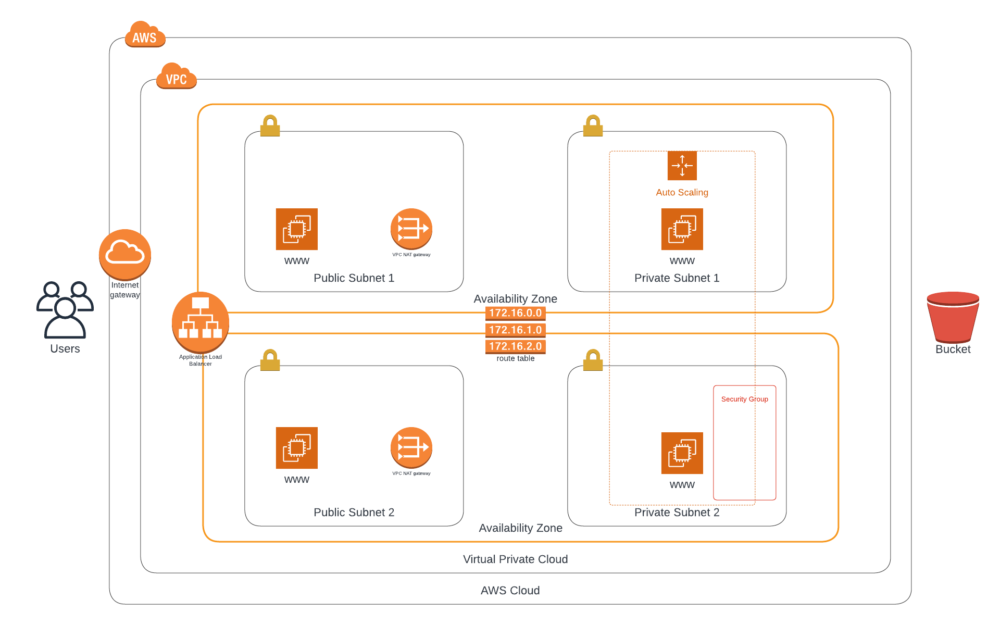

# Udagram

This project represents a template that is made for the AWS CloudFormation service.

1. Deploy the infra template  
`aws cloudformation create-stack --stack-name udagram-infra --template-body file://infra.yml  --parameters file://infra-parameters.json --capabilities "CAPABILITY_IAM" "CAPABILITY_NAMED_IAM" --region=us-east-1`

2. Deploy the servers template  
`aws cloudformation create-stack --stack-name udagram-servers --template-body file://servers.yml  --parameters file://servers-parameters.json --capabilities "CAPABILITY_IAM" "CAPABILITY_NAMED_IAM" --region=us-east-1`
